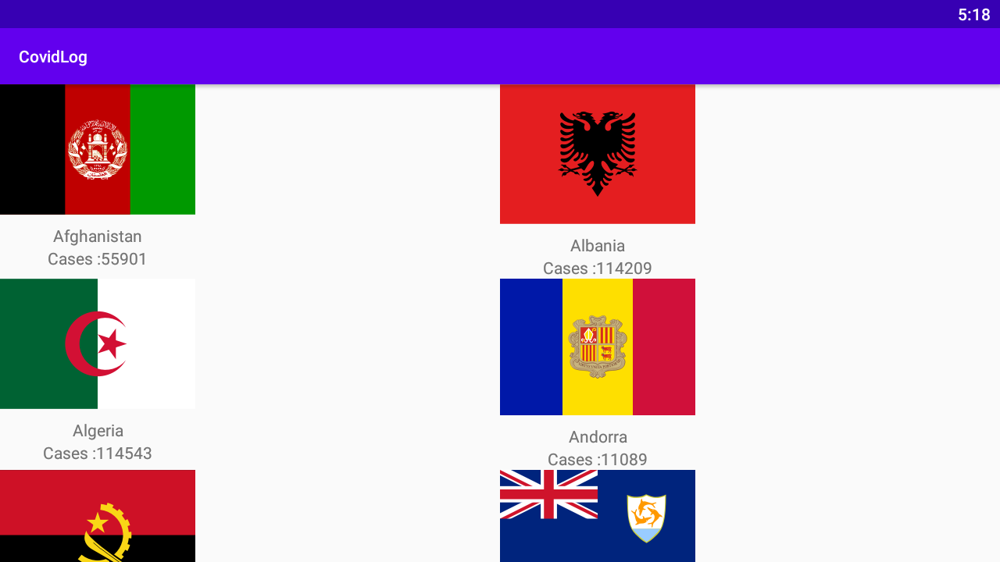

# CovidLog
This project is referenced from the post in website dev.to and the author is Benard Ngoda.

The url of post is 

https://dev.to/bensalcie/android-kotlin-get-data-from-restful-api-having-multiple-json-objects-o5a

I just try to copy his code and make this project for practice.

Demo:

